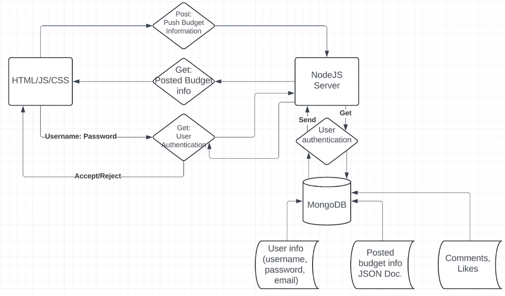

# Final Project: Budget Buddy Web App
_Group Members: Emily Choi, Yuna Dodobara, Leo Li, Sohshun Tateishi, Trevor Wong_

## Project Description
### Target Audience:
Our application provides budgeting resources to people who want to budget but don’t know how to do it properly; or alternatively, budget aware individuals who want to have an easier budgeting experience and want to compare their budget alongside other users. As it stands, nearly 30% of Americans don’t budget — and we’d like to provide tools to help that 30% and even the other 70% with budget builders, connections with other budgeters, and other useful tools in the form of a web app.

### Why would they use it:
The Budget Buddy web app would provide our users with the necessary tools to budget with zero financial background; perhaps even educating those potential users more about how budgeting works throughout the process. In using a web app that they can save their budgeting information by logging into an account, we create a tool that they can use at their own convenience without worrying about their data being entered as a one-time generation. Users can come back to the app whenever they want to view and update their information for their own benefit.

### Why as developers do we want to make this:
Our ambition to create this budget buddy web app stems from our past experience— most of us are in/have taken FIN 205 (Personal Finance) and we learned that budgeting is a powerful tool for people to use when planning their financial futures. Budgeting isn’t just preparing users to be financially independent, it extends to defining a person's future whether it be financially or it be in their character as a person. We wanted to create a platform where people can budget, learn, and grow alongside buddies.

## Technical Description
### Architectural Diagram

### User Personas
| User | User Persona Story |
| ---- | ------------------ |
| College Student | I would like to use the budget buddy app to help me manage my spending so I don’t have to worry about that and school |
| Young Adult (just moved out of parents house) | I’d like to use the budget buddy to help manage my expenses and discuss with other users like me and more experienced ones to see what I can do better. | 
| Young Adult (living with parents) | I’d like to use the budget buddy app to save money better and be able to know how much money I should be spending on different aspects of my life |
| Inexperienced Budgeter | I want to use the budget buddy app to learn more about budgeting by creating my own and sticking with it over time |
| Experienced Budgeter | I want to use the budget buddy app to discuss with other users about our budgets |

### User Stories
| Priority | User Description | Technical Implementation |
| -------- | ---------------- | ------------------------ |
| P0 | As a user, I want to login and logout of my budget account with all my information stored and secured |Establish **sessions and authentication with Microsoft Azure** in app.js; storing budget information in **MongoDB** but accessing it by filtering for the users id |
| P0 | As a new user, I want to create and save my projected budget to be used in the budget buddy web app | Store projected info in **MongoDB** using **POST** (in the projectedBudget db) |
| P0 | As a user who added their budget, I want to view my budget information in comparison to my actual spendings | Display stored budget information using **GET** to pull from **MongoDB** – filtered with the session users userID |
| P0 | As a user that has made purchases, I want to input my actual spending and income (easy to input info)| Store/update spending information in database (in the actualBudget) using **POST** |
| P0 | As a user, I want to see my net income and profit represented over a set period of time. | Using the **GET** API endpoints, read income data from database, apply filter for user specified time range, and calculate/return the net income and profit |
| P1 | As a user, I want to post my budgets to get input from other users | Create posts using **POST** and connect the post to the user with their user id |
| P1 | As a buddy that is interested in helping others out with their budgets, I want to comment on other budget posts | Create a comment using **POST** and connect to the post and user with the post id and user id |
| P1  | As a buddy, I want to like other budgeters posts so I can show I like it and maybe come back to it later | Create a like using **POST** and connect to the post and user with the post id and user id |
| P1  | As a buddy, I want to see how people reacted to my posted budget through comments and likes | Display comments and likes for each budget using **GET** |
| P1  | As a user, I want the choice to make my profile public or private | Only show user’s profile to others if they have public option chosen **(GET with parameters)** |

### Database Schemas

### API Endpoints
- GET /users/login - Allows users to login using authentication
- POST /post/create - Allows users to create posts (sends JSON of post)
- GET /post/{username}/:postID - See posts created by users (reads posts JSON from given user)
- POST /budget/create - Allows users to create budget (uploads budget to mongoDB)
- GET /budget/{username} - See budgets created by users (reads the users budget from mongoDB)
